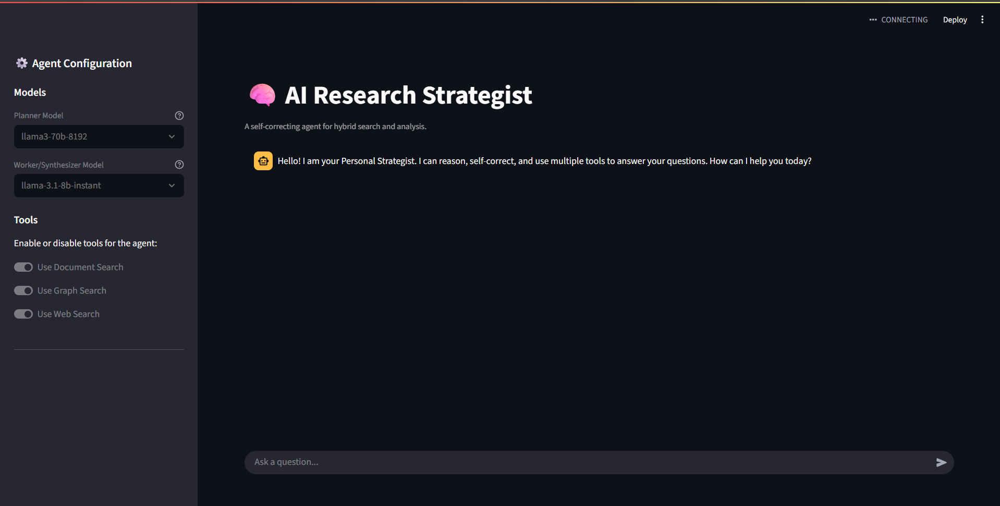

<!-- docker-compose up -d
python app.py -->
<!-- To-Do Improve Documentation -->
<!-- Add example usage: Provide sample queries, expected outputs, and explanations so users quickly understand how to run and test the system.

Visuals & Diagrams: Add architecture flowcharts, LangGraph schema visualizations, and pipeline diagrams to clarify data and control flow. -->
# 🧠 AI Research Strategist

An advanced, self-correcting RAG (Retrieval-Augmented Generation) system built with LangGraph. This project orchestrates multiple AI models and a hybrid knowledge base (Vector DB + Knowledge Graph) to function as a robust, automated research agent.

The agent can dynamically plan multi-step tasks, execute tools, reflect on the results, and self-correct its plan to find the best possible answer.



---

## ✨ Features

- **Multi-Agent Architecture**: Utilizes a `Planner` -> `Executor` -> `Critic` agentic loop, allowing the system to reason, act, and reflect.
- **Self-Correction Loop**: If initial tools fail to find relevant information, the agent automatically re-plans and tries different tools (e.g., switching from internal document search to live web search).
-   **Hybrid Knowledge Base**:
    -   **Vector Search**: Fast semantic search over private documents (`.pdf`, `.md`, `.txt`) using **ChromaDB** and Google embeddings.
    -   **Graph Search**: Structured queries over a knowledge graph to find complex relationships using **Neo4j**.
-   **Live Web Search**: Integrated with **Tavily Search API** for real-time information and news.
-   **High-Fidelity Retrieval**: Implements a **Cross-Encoder Reranker** (`BAAI/bge-reranker-base`) to significantly improve the quality and relevance of retrieved context.
-   **High-Performance LLMs**: Orchestrates powerful models like `Llama 3 70B` for planning and fast models like `Llama 3.1 8B` for execution, all powered by the **Groq API**.
-   **Transparent & Interactive UI**: A full-featured **Streamlit** dashboard that visualizes the agent's entire thought process, including failed attempts, final plans, retrieved data chunks with relevance scores, and cited sources.
-   **Automatic Citation Generation**: Automatically finds URLs in the final answer and formats them into a clean, numbered reference list.

---

## 🛠️ Tech Stack

-   **Orchestration**: LangChain & LangGraph
-   **LLM Providers**: Groq (Llama 3), Google AI (Embeddings)
-   **Vector Database**: ChromaDB
-   **Graph Database**: Neo4j (via Docker)
-   **Web Search Tool**: Tavily
-   **User Interface**: Streamlit

---

## 🚀 Getting Started

### 1. Prerequisites

-   Python 3.9+
-   Docker and Docker Compose (for Neo4j)
-   API keys for Groq, Google AI, and Tavily.

### 2. Installation

```bash
# Clone the repository
git clone https://github.com/your-username/your-repo-name.git
cd your-repo-name

# Create and activate a virtual environment
python -m venv venv
source venv/bin/activate  # On Windows, use `venv\Scripts\activate`

# Install the required packages
pip install -r requirements.txt
```

### 3. Environment Setup

1.  Rename the `.env.example` file to `.env`.
2.  Open the `.env` file and fill in your API keys and database credentials:

    ```env
    GROQ_API_KEY="gsk_..."
    GOOGLE_API_KEY="AIzaSy..."
    TAVILY_API_KEY="tvly-..."

    NEO4J_URI="bolt://localhost:7687"
    NEO4J_USERNAME="neo4j"
    NEO4J_PASSWORD="your-strong-password"
    ```
    *Note: The `NEO4J_PASSWORD` must match the one you will set in `docker-compose.yml`.*

### 4. Launch a Knowledge Base

1.  (Optional) If you have a password in your `.env` file, update the `NEO4J_AUTH` line in `docker-compose.yml` to match.
2.  Launch the Neo4j graph database container:

    ```bash
    docker-compose up -d
    ```
    You can verify it's running by visiting `http://localhost:7474` in your browser.

---

## ⚙️ Usage

The system has two main scripts: `ingest.py` to populate the knowledge bases and `app.py` to run the agent.

### 1. Ingest Your Data

1.  Place your source documents (`.pdf`, `.md`, `.txt`) into the `docs/` directory.
2.  Run the ingestion script. This will process the documents, create vector embeddings for ChromaDB, and extract entities/relationships for Neo4j.

    ```bash
    python ingest.py
    ```

### 2. Run the AI Research Strategist

Launch the Streamlit application:

```bash
streamlit run app.py
```

Your browser will open a new tab with the chat interface. You can now ask complex questions and watch the agent work!

---

## 🧩 Example Queries

-   **Hybrid Search**: "Compare Meta with its competitor, Google, and NVIDIA. Who founded each, and what recent news is there about them?"
-   **Document-Specific**: "Based on my documents, what is the difference between `wire` and `reg` in Verilog?"
-   **Self-Correction**: (If docs are irrelevant) "Who is the current CEO of OpenAI?" - The agent will first search local docs, fail, and then automatically re-plan to use web search.

---

## 📄 License

This project is licensed under the **MIT License**. See the `LICENSE` file for details.